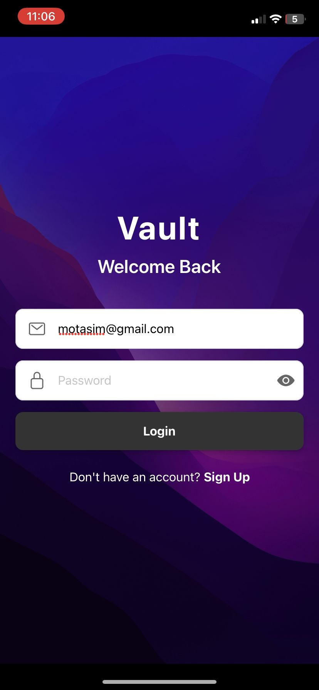

# Vault Chat App (Advanced Version)

This is the **advanced version** of my original chat application, which I developed as part of my graduation project. It is now rebuilt using **Expo** to provide a smoother **mobile** and **web** experience.

This version continues to use **Firebase** as the backend for authentication, real-time chat, media storage, and notifications.

## 🔗 Link to Original Project

Check out the original version of this app (graduation project):

👉 [Vault Chat App (Original Version)](https://github.com/mxtasim/Vault-Chat-App)

## 🚀 Features

- Built with **Expo** for cross-platform compatibility
- Firebase integration for:
  - Authentication (email/password)
  - Real-time messaging
  - Image, file & voice message sharing
  - Push notifications
  - Message read status (Seen/Delivered)
- Search for users & send friend requests
- Friend list & private chat
- Emoji support

## 🛠️ Tech Stack

- **Frontend**: React Native (Expo)
- **Backend**: Firebase (Firestore, Auth, Storage, Cloud Messaging)

## 📱 Platforms Supported

- Android
- iOS
- Web

### Login Screen

---

### Chat Interface Example 2

🧑‍💻 Author
Motasim Abuhalima

GitHub: @mxtasim

