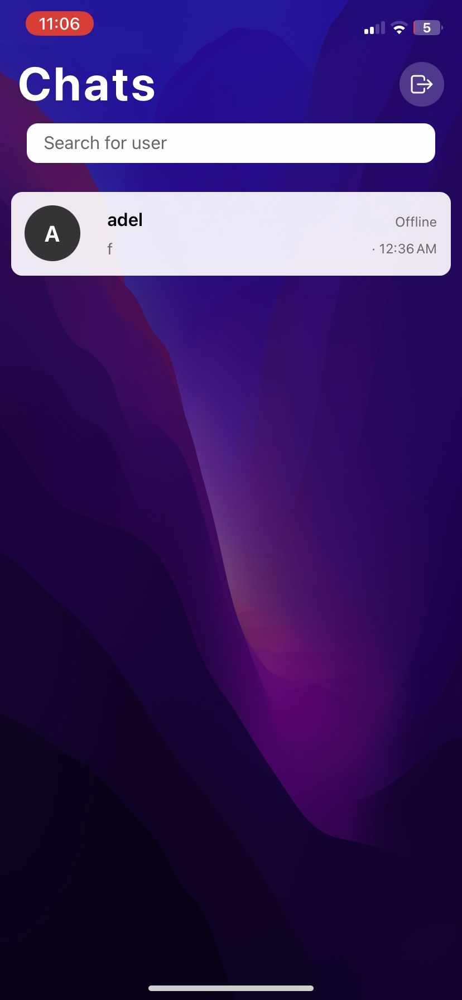
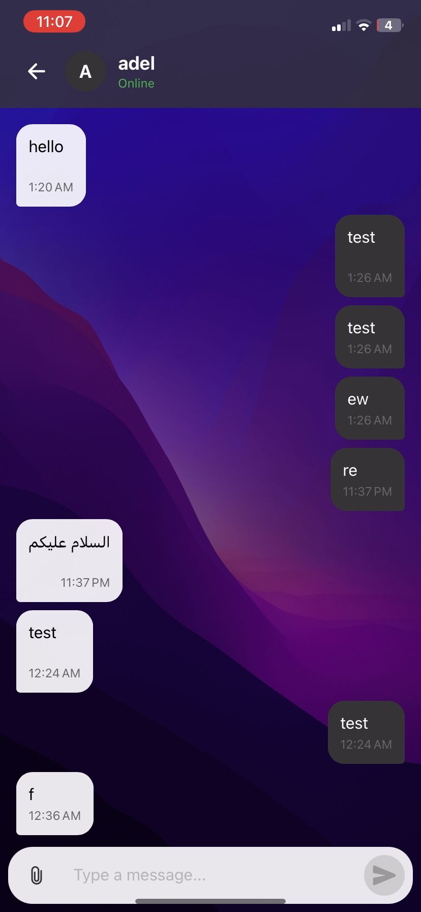

# Vault Chat App (Advanced Version)

This is the **advanced version** of my original chat application, which I developed as part of my graduation project. It has been rebuilt using **Expo** to provide a smoother experience across **mobile** and **web platforms**.

The app uses **Firebase** as the backend for real-time chat, user authentication, cloud storage, and push notifications.

## 🔗 Link to Original Project

Check out the original version of this app (basic version):

👉 [Vault Chat App (Original Version)](https://github.com/mxtasim/Vault-Chat-App)

## 🚀 Getting Started

```bash
npm install       # Install dependencies
npx expo start    # Start development server
```

---

## ✅ Features Implemented

- Built with **Expo** for cross-platform deployment
- Firebase integration for:
  - Email/password authentication
  - Real-time messaging
  - Image, file, and voice message sharing
  - Push notifications
  - Message read status (Seen/Delivered)
- Friend system with search and request handling
- Private 1-on-1 chat interface
- Emoji support for better user interaction

## 🛠️ Tech Stack

- **Frontend**: React Native (Expo)
- **Backend**: Firebase (Firestore, Auth, Storage, Cloud Messaging)

## 📱 Supported Platforms

- Android
- iOS
- Web

## 📸 Screenshots

<div align="center">
  
  
  
</div>

## 🧑‍💻 Author

**Motasim Abuhalima**

- GitHub: [@mxtasim](https://github.com/mxtasim)
